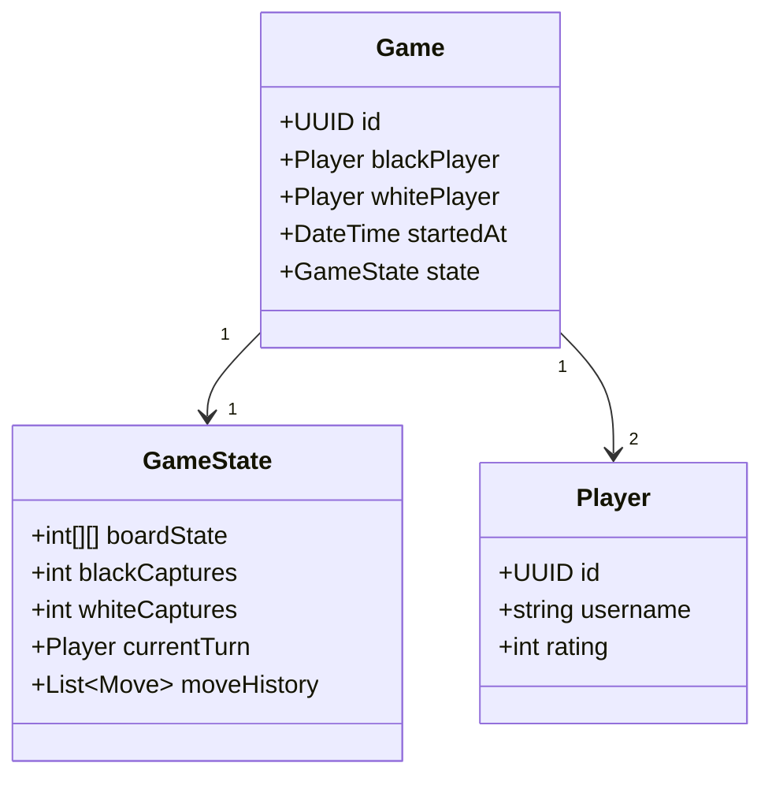

# Feature Specification: Go Implementation

## Overview
This specification defines the core implementation of the Go project - a web application implementing the game of Go (Baduk) with multiplayer functionality. The application will provide a complete game lifecycle including matchmaking, gameplay, scoring, and game history.

## User Stories
1. As a player, I want to create a new game session so I can start playing against an opponent
2. As a player, I want to place stones on the board according to Go rules so I can compete strategically
3. As a spectator, I want to watch ongoing games so I can learn from other players
4. As a player, I want to see captured stone counts so I can track game progress
5. As a user, I want to view my game history so I can analyze past matches

## Functional Requirements
### Core Gameplay
- **FR1**: Game board rendering  
  - 19x19 grid with standard Go board styling
  - Visual distinction between black and white stones
- **FR2**: Stone placement  
  - Players alternate placing stones on intersections
  - Prevent invalid moves (suicide rule, ko rule)
- **FR3**: Capture detection  
  - Automatically remove surrounded stones
  - Update captured stone counters

### Game Management
- **FR4**: Matchmaking system  
  - Create public/private game rooms
  - Support player-vs-player and player-vs-AI modes
- **FR5**: Game state persistence  
  - Save game state after each move
  - Allow game resumption after disconnect
- **FR6**: Game conclusion  
  - Detect when both players pass consecutively
  - Calculate territory and score

## Non-Functional Requirements
### Performance
- **NFR1**: Board responsiveness  
  - Stone placement feedback within 200ms
- **NFR2**: Game load time  
  - Load existing game state within 1 second

### Accessibility
- **NFR3**: WCAG 2.1 AA compliance  
  - Color contrast ratio ≥4.5:1
  - Keyboard navigation support

### Offline Capability
- **NFR4**: Offline play  
  - Resume games without network connection
  - Sync game state when reconnected

## UI/UX Description
- **Game Board**:  
    
  - Wood-textured background with grid lines
  - Stone placement animations
  - Territory highlighting during scoring
- **Game Controls**:  
  - Pass button
  - Resign button
  - Score calculation toggle
- **Information Panel**:  
  - Player turn indicator
  - Captured stone counters
  - Game timer

## Data Model

## Acceptance Criteria
1. **AC1**: Game creation  
   - Users can create new games with configurable settings (board size, handicap)
   - New games appear in public lobby within 5 seconds

2. **AC2**: Valid move enforcement  
   - System prevents suicide moves with visual feedback
   - Ko rule violations are automatically rejected

3. **AC3**: Scoring accuracy  
   - Territory calculation matches manual scoring within 0.5 points
   - Score calculation works for all standard board sizes (9x9, 13x13, 19x19)

4. **AC4**: Offline resilience  
   - Game state persists through browser refresh
   - Players can complete turns offline with sync within 10s of reconnection

5. **AC5**: Spectator experience  
   - Observers see moves within 3 seconds of placement
   - Spectator view clearly indicates current player turn

## Success Criteria
1. **SC1**: Game completion rate  
   - 95% of started games reach conclusion (not abandoned)

2. **SC2**: Move accuracy  
   - 99.9% of valid moves processed correctly

3. **SC3**: Performance under load  
   - Supports 100 concurrent games with <500ms move processing

4. **SC4**: Accessibility compliance  
   - Passes all automated WCAG 2.1 AA checks

## Out of Scope
- User account management
- Ranking/tournament systems
- Chat functionality
- Mobile app development

## Assumptions
- Players understand basic Go rules
- Standard Japanese scoring rules apply
- AI opponent uses basic heuristic algorithms
- Games use absolute time settings (30min/player)

## Dependencies
- Go rule validation library