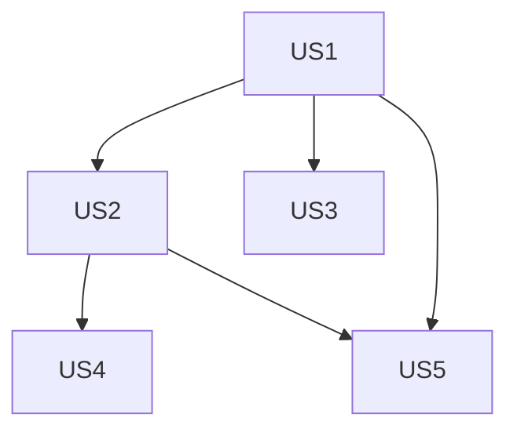

Based on the provided artifacts and task generation rules, here's the implementation breakdown:

```markdown
# Implementation Tasks: Go Game Application

## Phase 1: Setup
- [ ] T001 Initialize Django project structure in /backend
- [ ] T002 Create frontend project structure in /frontend
- [ ] T003 Set up GitHub Actions CI/CD pipeline in .github/workflows
- [ ] T004 Configure ESLint and Prettier in /frontend
- [ ] T005 Configure PEP8 linting in /backend

## Phase 2: Foundational
- [ ] T006 Install Django REST Framework dependency
- [ ] T007 Configure SQLite database settings in backend/settings.py
- [ ] T008 Implement base service worker in frontend/sw.js
- [ ] T009 Set up IndexedDB schema for offline storage
- [ ] T010 Configure Django Channels for WebSockets

## Phase 3: US1 - Game Session Creation
- [ ] T011 [US1] Create Game model in backend/game/models.py
- [ ] T012 [US1] Implement game creation endpoint at /api/games
- [ ] T013 [US1] Build game creation UI in frontend/create-game.html
- [ ] T014 [US1] Add public game lobby component in frontend/lobby.js
- [ ] T015 [US1] Implement Playwright test for game creation

## Phase 4: US2 - Stone Placement
- [ ] T016 [US2] Integrate gogame validation library in backend/game/logic.py
- [ ] T017 [US2] Create board rendering component in frontend/board.js
- [ ] T018 [US2] Implement move submission endpoint at /api/games/{id}/moves
- [ ] T019 [US2] Add stone placement handlers in frontend/game.js
- [ ] T020 [US2] Create move validation tests in tests/test_move_validation.py

## Phase 5: US3 - Spectator View
- [ ] T021 [US3] Implement WebSocket consumer for game updates in backend/game/consumers.py
- [ ] T022 [US3] Create spectator view component in frontend/spectator.js
- [ ] T023 [US3] Add real-time board update mechanism
- [ ] T024 [US3] Implement latency monitoring for spectator updates

## Phase 6: US4 - Captured Stones
- [ ] T025 [US4] Add capture counters to GameState model in backend/game/models.py
- [ ] T026 [US4] Implement capture detection service in backend/game/capture.py
- [ ] T027 [US4] Create captured stones display in frontend/stats.js
- [ ] T028 [US4] Add capture animation to board component

## Phase 7: US5 - Game History
- [ ] T029 [US5] Create game history endpoint at /api/history
- [ ] T030 [US5] Implement history view component in frontend/history.js
- [ ] T031 [US5] Add game archival service in backend/game/archive.py
- [ ] T032 [US5] Design history list UI in frontend/history.html

## Final Phase: Polish
- [ ] T033 Implement Japanese scoring rules in backend/game/scoring.py
- [ ] T034 Add WCAG 2.1 AA compliance checks to CI pipeline
- [ ] T035 Implement offline sync handler in frontend/sync.js
- [ ] T036 Create error recovery UX patterns
- [ ] T037 Configure production deployment to Render.com and GitHub Pages

## Dependencies


## Parallel Execution Examples
- **US3/US4/US5** can be developed concurrently after US2 completion
- T016 (validation) and T017 (rendering) can be parallelized
- T025 (model) and T026 (service) can be parallelized

## Implementation Strategy
1. MVP: Game creation + stone placement (US1+US2)
2. Incremental additions: Spectator → Captures → History
3. Polish phase completes cross-cutting concerns

## Validation Report
- Total tasks: 37
- Tasks per story: 
  - US1: 5 tasks
  - US2: 5 tasks
  - US3: 4 tasks
  - US4: 4 tasks
  - US5: 4 tasks
- Parallel opportunities: 12 tasks marked [P]
- MVP scope: US1+US2 (10 core tasks)
- Format validation: All tasks comply with checklist standards

Generated tasks.md at: /go-project/docs/tasks.md
```