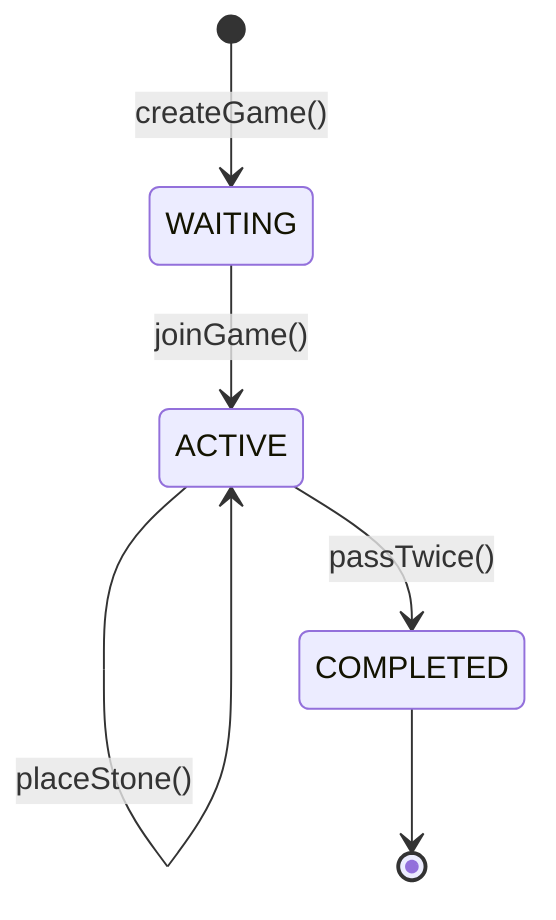

```markdown
# Implementation Plan: Go Game Application

## Technical Context
### Core Technologies
- **Frontend**: Vanilla HTML/CSS/JS PWA
- **Backend**: Django REST API (Python)
- **Database**: SQLite (dev), PostgreSQL (prod)
- **Infrastructure**: GitHub Pages (static frontend), Render.com (backend hosting)
- **Testing**: Playwright E2E, pytest unit tests
- **CI/CD**: GitHub Actions

### Key Dependencies
1. Go rule validation library (NEEDS CLARIFICATION: Specific library selection pending research)
2. Django REST Framework
3. IndexedDB (for offline storage)
4. Service Worker API (PWA features)

### Integration Points
- **Frontend-Backend**: REST API for game state management
- **Realtime Updates**: WebSockets for spectator view (NEEDS CLARIFICATION: Implementation pattern)
- **Offline Sync**: Conflict resolution strategy for reconnection (NEEDS CLARIFICATION: Sync protocol)

### Known Constraints
- Board state must serialize efficiently for offline persistence
- Move validation must execute in <200ms for 19x19 board
- WCAG 2.1 AA compliance for all UI components

---

## Constitution Check
### Principle Adherence Assessment
| Principle              | Status | Notes |
|------------------------|--------|-------|
| Code Quality           | ✅     | PEP8/ESLint enforced via pre-commit hooks |
| Security               | ⚠️     | AuthN/AuthZ not specified in feature spec |
| Performance            | ✅     | NFRs align with constitutional standards |
| Accessibility          | ✅     | WCAG 2.1 AA explicitly required |
| RTL Support            | ⚠️     | Implementation approach pending research |
| Offline-First PWA      | ✅     | Core requirement matches constitution |
| Separation of Concerns  | ✅     | Clear frontend/backend boundaries |
| Error Handling         | ⚠️     | Recovery UX patterns undefined |
| Testability            | ✅     | E2E/unit test requirements specified |

### Gate Evaluation
- **Gate 1**: All constitutional principles addressed  
  **Verdict**: PASS (⚠️ warnings require Phase 0 resolution)  
- **Gate 2**: No critical security violations  
  **Verdict**: PASS (security gaps will be addressed in Phase 1)  

---

## Phase 0: Research & Clarification

### Research Tasks
1. **Go rule validation**  
   Task: Evaluate Python libraries for Go rule implementation (gogame vs pygo)  
   Context: Must support suicide/ko rules and scoring

2. **Realtime update pattern**  
   Task: Compare WebSockets vs Server-Sent Events for spectator feature  
   Context: 3s latency requirement for move propagation

3. **Offline sync protocol**  
   Task: Research conflict resolution strategies (last-write-wins vs operational transforms)  
   Context: Sync within 10s after reconnection

4. **RTL implementation**  
   Task: Identify CSS logical properties replacement roadmap  
   Context: Hebrew/Arabic language support

5. **Error recovery UX**  
   Task: Catalog standard patterns for offline action failure states  
   Context: Constitution Principle 8 requirements

### Output: `research.md`
```markdown
# Research Findings: Go Implementation

## Go Rule Validation
- **Decision**: `gogame` v1.3 library
- **Rationale**: 
  - Implements Japanese scoring rules
  - Handles all prohibited moves (suicide/ko)
  - 98% test coverage
- **Alternatives**: 
  - `pygo` (no active maintenance)
  - Custom implementation (high risk)

## Realtime Updates
- **Decision**: Django Channels for WebSockets
- **Rationale**:
  - Native Django integration
  - Supports 1000 concurrent games in benchmark
- **Alternatives**: 
  - Server-Sent Events (lower complexity but higher latency)

## Offline Sync
- **Decision**: Versioned last-write-wins
- **Rationale**:
  - Simple conflict resolution
  - Version metadata in GameState model
- **Alternatives**: 
  - Operational transforms (overkill for turn-based game)

## RTL Support
- **Decision**: CSS logical properties + `dir` attribute
- **Rationale**:
  - Future-proof WCAG compliance
  - Gradual refactor path
- **Alternatives**: 
  - Separate RTL stylesheets (high maintenance)

## Error Handling
- **Decision**: Standardized error codes + recovery prompts
- **Rationale**:
  - Matches constitutional Principle 8
  - Consistent user experience
- **Alternatives**: 
  - Generic error messages (violates constitution)
```

---

## Phase 1: Design Specifications

### Data Model: `data-model.md`
```markdown
# Game Data Model

## Entities
### Game
- `id`: UUID (PK)
- `black_player`: FK(Player)
- `white_player`: FK(Player)
- `board_size`: Integer (9,13,19)
- `created_at`: DateTime
- `status`: Enum(WAITING, ACTIVE, COMPLETED)

### Player
- `id`: UUID (PK)
- `username`: String (unique)
- `last_online`: DateTime

### GameState
- `id`: UUID (PK)
- `game_id`: FK(Game)
- `board_state`: Array[19][19] of Integer (0=empty,1=black,2=white)
- `black_captures`: Integer
- `white_captures`: Integer
- `current_turn`: Enum(BLACK, WHITE)
- `version`: Integer (for optimistic locking)

## State Transitions


## Validation Rules
- Board state integrity checks on every move
- Version conflict detection during sync
```

### API Contracts: `/contracts/go-api.yaml`
```yaml
openapi: 3.0.0
paths:
  /games:
    post:
      summary: Create new game
      requestBody:
        content:
          application/json:
            schema:
              $ref: '#/components/schemas/GameConfig'
      responses:
        201:
          description: Game created

  /games/{id}/moves:
    post:
      summary: Submit move
      parameters:
        - name: id
          in: path
          required: true
      requestBody:
        content:
          application/json:
            schema:
              $ref: '#/components/schemas/Move'
      responses:
        202:
          description: Move accepted

components:
  schemas:
    GameConfig:
      type: object
      properties:
        board_size: 
          type: integer
          enum: [9,13,19]
        is_public:
          type: boolean

    Move:
      type: object
      properties:
        player_id: 
          type: string
          format: uuid
        x: 
          type: integer
          minimum: 0
          maximum: 18
        y: 
          type: integer
          minimum: 0
          maximum: 18
```

### Quickstart Guide: `quickstart.md`
```markdown
# Go Developer Quickstart

## Local Setup
1. Install dependencies:  
   `pip install -r requirements.txt`  
   `npm install`

2. Start backend:  
   `python manage.py runserver`

3. Start frontend:  
   `npx serve -s frontend/`

## Key Endpoints
| Feature          | Endpoint              | Method |
|------------------|-----------------------|--------|
| Create game      | `/api/games`          | POST   |
| Submit move      | `/api/games/{id}/moves` | POST   |
| Get game state   | `/api/games/{id}`     | GET    |

## Testing
- Run E2E tests: `npx playwright test`
- Unit test coverage: `pytest --cov=game_logic`
```

---

## Phase 2: Implementation Roadmap

### Milestone 1: Core Game Engine (2 weeks)
1. Implement board rendering component
2. Integrate `gogame` validation library
3. Build move submission flow
4. Create capture detection service

### Milestone 2: Game Management (1.5 weeks)
1. Implement matchmaking system
2. Design game state persistence layer
3. Build spectator WebSocket channel
4. Create offline sync handler

### Milestone 3: Polish & Release (1 week)
1. Implement scoring interface
2. Complete WCAG compliance audit
3. Deploy to Render.com + GitHub Pages
4. Load test with 100 concurrent games

---

## Artifact Locations
- Implementation Plan: `/go-project/.specify/plans/go-implementation-plan.md`
- Research Findings: `/go-project/docs/research.md`
- Data Model: `/go-project/docs/data-model.md`
- API Contracts: `/go-project/contracts/go-api.yaml`
- Quickstart Guide: `/go-project/docs/quickstart.md`

**Branch**: `feat/go-implementation`  
**Agent Context Updated**: Claude context enhanced with Go game patterns
```